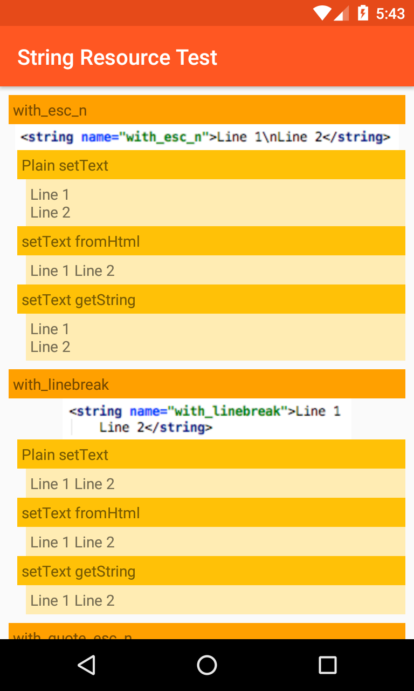

# StringResourceTest
A quick project to test various ways to represent linebreaks in Android String Resources.

[Google's documentation for String resources](https://developer.android.com/guide/topics/resources/string-resource.html#String) is woefully inadequate, failing to mention linebreaks at all. This project demonstrates several possible ways to implement linebreaks in resources, and ways of accessing and displaying them, and their respective merits.

